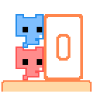
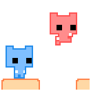
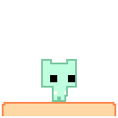
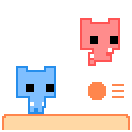

# 2026 OOPL Final Report

## 組別資訊

組別：T02  
組員：陳書璿  
復刻遊戲：PICO PARK: Classic Edition

## 專案簡介
本專案以《PICO PARK: Classic Edition》為參考，製作本機多人合作平台遊戲。

### 遊戲簡介
玩家操控不同顏色的貓咪角色，在關卡中透過跳躍、推箱、踩按鈕觸發機關、躲避怪物、取得鑰匙，並共同進入出口門來完成任務。

遊戲核心目標並非單純讓單一玩家抵達終點，而是讓 2 到 8 名玩家互相配合。部分機關會根據玩家人數調整需求，例如需要多人同時推動的箱子、需要所有玩家進入門內才算過關，以及第三關要求所有玩家共同輸入同一方向來控制角色。這些設計使遊戲重點落在團隊溝通、分工與同步操作上。

本專案已完成的內容包含：

- 標題畫面、主選單、離開確認、選項選單、鍵盤設定、玩家人數選擇、開始遊戲畫面、關卡選擇、關卡暫停選單。
- 2 到 8 人本機遊玩流程。
- 4 個可遊玩的關卡。
- 自訂鍵盤配置與衝突檢查。
- BGM、音效、背景主題與音量設定。
- 關卡最佳時間紀錄與關卡完成標記（皇冠）。
- 開發測試用 Hack Menu，以便快速驗證關卡流程。

### 組別分工

| 成員 | 主要負責內容                                          |
|------|-------------------------------------------------|
| 陳書璿 | 遊戲流程、場景管理、角色控制、物理系統、關卡機關、UI 選單、存檔設定與期末報告製作等全部內容 |

## 遊戲介紹

### 遊戲規則

1. 玩家首先在 Local Play 畫面選擇 2 到 8 人遊玩。
2. 每位玩家使用鍵盤設定中綁定的按鍵控制角色移動與跳躍。
3. 玩家必須在關卡中取得鑰匙，帶著鑰匙碰到門後會自動開門。
4. 門開啟後，所有玩家皆須站到門前並按下「上」鍵進入門內。
5. 全部玩家進入門後，系統會紀錄該關卡在目前玩家人數下的最佳通關時間與通關紀錄。
6. 關卡中按下 `ESC` 會開啟暫停選單，玩家可選擇繼續、重試、回到關卡選擇或回到標題畫面。

角色與選單操作預設鍵位如下，玩家亦可在 Keyboard Config 中重新設定：

| 玩家 | 移動 / 選單操作 | 跳躍 / 上               | 備註                 |
|------|------|----------------------|--------------------|
| 1P | `A` / `D` | `W`                  | 預設啟用               |
| 2P | `LEFT` / `RIGHT` | `UP`                 | 預設啟用               |
| 3P-8P | 由 Keyboard Config 設定 | 由 Keyboard Config 設定 | 未設定足夠按鍵時，無法選擇該人數遊玩 |

選單確認操作固定為 `Enter` 鍵，左右移動操作為 `A/D` 鍵，回到上一頁/Cancel 操作為 `ESC` 鍵。

#### 關卡設計

| 關卡 | 主題 | 主要玩法 | 過關條件 |
|------|------|----------|----------|
| Level 1 | 推箱與鑰匙 | 玩家需要合作推動箱子，取得鑰匙後開門 | 全員進門 |
| Level 2 | 按鈕與移動平台 | 其中一名玩家踩著另一名玩家跳過洞口並按下按鈕，使平台移動，讓其他玩家亦能通過；角色掉落時會被傳送回安全位置 | 全員進門 |
| Level 3 | 共識控制、怪物與移動平台 | 多位玩家共同控制單一角色，必須同步按下移動或跳躍鍵才會執行對應動作；包含怪物、復活位置更新機制與死亡重生機制 | 角色進門 |
| Level 4 | 子彈與罐子 | 子彈從砲台射出，玩家需躲避子彈並引導子彈擊破罐子；子彈碰到玩家時會消失，罐子破裂後才能取得鑰匙 | 全員進門 |

Level Select 畫面保留 10 個關卡格，但目前僅實作 Level 1 到 Level 4。Level 5 到 Level 10 為預留擴充位置，尚未接上實際關卡。

### 遊戲畫面

遊戲畫面由全域背景、地板、標題列、門、角色、關卡物件與 UI 文字組成。主要素材放置於 `Resources/Image/` 目錄下，例如：

- 角色：`Resources/Image/Character/*_cat/`
- 背景、選單框與雜項：`Resources/Image/Background/`
- 關卡特有：`Resources/Image/Level_Cover/`
- 按鈕：`Resources/Image/Button/`

代表性關卡封面：






## 程式設計

### 程式架構

專案程式架構主要分為四個模組：

| 模組 | 位置 | 職責 |
|------|------|------|
| App | `include/app/`, `src/app/` | 程式進入點、主迴圈、場景基底類別、場景切換與管理 |
| Scenes | `include/scenes/`, `src/scenes/` | 實際顯示的遊戲畫面，例如選單、鍵盤設定、關卡選擇與 Level 1-4 |
| Game | `include/game/`, `src/game/` | 可顯示或可互動的物件，例如角色、文字、按鈕、可推箱子 |
| Systems | `include/systems/`, `src/systems/` | 物理、碰撞、推力解析、音效、主題背景、全域演員、存檔與 Session 狀態 |

整體設計以 `Scene` 作為抽象基底類別。每個畫面皆繼承 `Scene` 並實作 `OnEnter()`、`OnExit()`、`Update()`，以維持一致的場景生命週期。`SceneManager` 負責註冊場景與處理場景操作，支援切換場景、推入暫停覆蓋層、返回覆蓋層、重啟底層關卡等功能。

```text
App
  -> SceneManager
      -> TitleScene
      -> MenuScene
      -> OptionMenuScene
      -> KeyboardConfigScene
      -> LocalPlayScene
      -> LocalPlayGameScene
      -> LevelSelectScene
      -> LevelExitScene
      -> LevelOneScene
      -> LevelTwoScene
      -> LevelThreeScene
      -> LevelFourScene
```

角色與物件則以繼承和介面組合實作：

```text
Util::GameObject
  -> Character
      -> PushableBox (+ IPhysicsBody)
      -> UITriangleButton
  -> AnimatedCharacter
      -> PlayerCat (+ IPhysicsBody)
  -> GameText
```

物理物件共同實作 `IPhysicsBody`，而 `IPhysicsBody` 又拆成多個小介面，例如 transform、material、motion、collision listener、push reactive、lifecycle。此設計使 `PhysicsWorld` 能以同一套流程更新玩家、箱子、子彈、靜態牆面、移動平台與敵人。

### 程式流程

程式由 `src/app/main.cpp` 建立 `App`，再進入 PTSD 框架的更新流程。`App::Start()` 負責完成初始化：

1. 建立 `GlobalActors`、`SessionState`、`SceneManager`。
2. 建立全域背景、地板、標題列與出口門。
3. 建立 `BGMPlayer` 與 `AudioService` 並播放 BGM。
4. 建立 `VisualThemeService` 管理背景主題。
5. 建立起始畫面顯示用的貓咪角色。
6. 註冊所有已實作場景。
7. 進入 `TitleScene`。

每一幀 `App::Update()` 的主要流程如下：

1. `AudioService::UpdateBgm()` 更新背景音樂狀態。
2. `SceneManager::UpdateCurrent()` 更新目前場景。
3. 場景若提出 `SceneOp`，由 `SceneManager` 統一執行場景切換。
4. 檢查 `SessionState::ShouldQuit()` 是否要求結束遊戲。
5. 呼叫 `m_Root.Update()`，更新所有場景物件的顯示與狀態。

關卡中的物理流程由 `PhysicsWorld::Update()` 統一管理：

1. 呼叫每個物理物件的 `PhysicsUpdate()`，只計算「預期移動量」。
2. `CollisionSolver` 進行 AABB 碰撞解析，分成水平與垂直方向處理。
3. `SupportResolver` 偵測角色是否站在平台、箱子或其他玩家上，支援平台帶動與堆疊。
4. `PushForceResolver` 計算有多少角色正在推動同一個物件，決定箱子是否能被推動。
5. 套用解析後的位移並觸發碰撞回呼。

### 程式技術

| OOP 概念 | 專案中的應用 |
|----------|--------------|
| 封裝 | `PhysicsWorld` 封裝物理更新；`PlayerCat` 封裝角色速度、跳躍、動畫狀態 |
| 繼承 | `TitleScene`、`LevelOneScene` 等場景繼承 `Scene`；`PlayerCat` 繼承 `AnimatedCharacter` |
| 多型 | `SceneManager` 只透過 `Scene*` 呼叫 `Update()`；`PhysicsWorld` 只透過 `IPhysicsBody` 操作不同物件 |
| 介面隔離 | 物理介面拆成 `IPhysicsTransform`、`IPhysicsMotion`、`IPhysicsMaterial` 等，讓類別只實作需要的行為 |
| 組合 | 場景持有 `PhysicsWorld`、角色、UI、關卡物件；`SceneServices` 把音效、主題、Session、全域演員注入場景 |

#### OOP 概念詳細例子

**封裝：`PlayerCat` 封裝角色狀態與操作方式**

`PlayerCat` 內部保存角色移動、跳躍和動畫需要的資料，例如 `m_MoveDir`、`m_VelocityY`、`m_Grounded`、`m_CurrentAnimState`、`m_DesiredDelta`。這些資料不會讓關卡直接任意修改，而是透過公開方法控制，例如 `SetMoveDir()`、`Jump()`、`SetInputEnabled()`、`PhysicsUpdate()`、`ApplyResolvedDelta()`。因此關卡只需要告訴角色「往左或往右」、「現在要跳」，不需要知道重力、速度、落地判定、動畫切換等細節。這就是將角色的資料和行為包在同一個類別中，並限制外部只能透過定義好的介面使用。

**繼承：各個場景繼承共同的 `Scene` 基底類別**

`TitleScene`、`MenuScene`、`LevelOneScene`、`LevelTwoScene` 等皆繼承 `Scene`。`Scene` 規定每個場景都必須實作 `OnEnter()`、`OnExit()` 和 `Update()`，因此不論是選單畫面或遊戲關卡，都具有一致的生命週期。子類別可以各自實作不同內容，例如 `LevelOneScene::Update()` 處理玩家輸入、物理更新、撿鑰匙和開門；`MenuScene::Update()` 則處理選單按鈕。此設計可共用場景架構，同時保留每個場景自己的行為。

**多型：`SceneManager` 用 `Scene*` 更新不同場景**

`SceneManager` 不需要知道目前場景實際上是 `TitleScene`、`LevelSelectScene` 或 `LevelFourScene`。它只需取得目前場景的 `Scene*`，並呼叫 `current->Update()`，程式便會自動執行該子類別覆寫後的 `Update()`。此設計使新增場景時不需要在主迴圈撰寫大量 `if` 或 `switch` 判斷場景類型，只需將新場景註冊進 `SceneManager` 即可。

**介面隔離：`IPhysicsBody` 拆成多個物理相關介面**

物理系統並未將所有行為都放入單一大型介面，而是將能力拆分為 `IPhysicsTransform`、`IPhysicsMaterial`、`IPhysicsMotion`、`IPhysicsCollisionListener`、`IPhysicsPushReactive`、`IPhysicsLifecycle` 等小介面，再由 `IPhysicsBody` 組合起來。此設計使物理物件的職責更清楚：位置和大小屬於 transform，是否可碰撞屬於 material，預期移動量屬於 motion，碰撞後反應屬於 collision listener。`PlayerCat`、`PushableBox`、`BulletBody`、`StaticBody` 都可以使用同一套物理流程，但各自提供不同的實作。

**組合：關卡用多個物件組合出完整玩法**

以 `LevelFourScene` 為例，關卡本身持有多個成員物件來組合玩法，例如 `PhysicsWorld m_World`、多個 `PlayerCat`、`m_JarSprite`、`m_ShooterSprite`、`m_BulletBody`、`m_KeySprite`、`m_TimerText` 和 `HackMenu`。關卡負責協調這些物件：子彈由 `BulletBody` 處理物理碰撞，畫面由 `Character` 顯示，計時由 `GameText` 顯示，整體更新由 `LevelFourScene::Update()` 串接。這是「has-a」關係，也就是以物件組合出功能。

以下為程式內重要系統說明。

#### 物理系統

本專案的物理系統以 `PhysicsWorld` 作為核心管理者，所有需要參與碰撞或移動解析的物件都會透過 `Register()` 加入物理世界，例如 `PlayerCat`、`PushableBox`、`BulletBody`、`StaticBody`，以及關卡中使用的移動平台或敵人物件。關卡本身不直接處理每個物件之間的碰撞細節，而是在每一幀呼叫 `m_World.Update()`，由物理系統統一完成更新。

物理更新採用分階段流程。第一階段先呼叫各物件的 `PhysicsUpdate()`，讓物件根據輸入、重力或自身邏輯計算出 `GetDesiredDelta()`，也就是本幀的「預期移動距離」。第二階段由 `CollisionSolver` 根據 AABB 碰撞進行水平與垂直方向解析，避免玩家、箱子、牆壁、地板和平台互相穿透。第三階段再將解析後的位移套用回物件，並透過 `OnCollision()` 通知物件碰撞結果。

除了基本碰撞外，物理系統亦支援合作遊戲所需的特殊行為。`SupportResolver` 會偵測角色是否站在平台、箱子或其他玩家上，使移動平台能帶著玩家移動，並讓角色堆疊時更穩定。`PushForceResolver` 則用來計算有多少角色正在同方向推動箱子，讓 `PushableBox` 可以根據關卡設定的需求人數決定是否移動。這些邏輯集中在系統層後，關卡只需要設定物件與規則，不需要在每個關卡重複撰寫碰撞與推力判斷。

#### 場景管理

`SceneManager` 使用 `SceneId` 與 `std::unordered_map` 管理場景實例，並以 stack 保存目前場景狀態。暫停選單使用 overlay 方式推到關卡上方：進入 `LevelExitScene` 時，底層關卡會執行 `PauseGameplay()`；離開後則呼叫 `ResumeGameplay()`。此設計使暫停選單不需要破壞原本關卡狀態。

#### 輸入與鍵盤設定

`KeyboardConfigScene` 支援 8 位玩家的按鍵設定，資料儲存在 `Resources/Save/settings.json`。玩家 1 預設使用 `WASD`，玩家 2 預設使用方向鍵。若後續玩家未設定足夠按鍵，`LocalPlayScene` 會阻止選擇超過已設定的人數。

#### 存檔

`SaveManager` 使用 nlohmann/json 儲存兩種資料：

- `Resources/Save/settings.json`：背景顏色、BGM 音量、SE 音量、顯示編號、玩家鍵位。
- `Resources/Save/save_data.json`：10 個關卡在 2P 到 8P 下的最佳通關時間。

關卡完成時會呼叫 `SaveManager::UpdateBestTime(levelIndex, playerCount, elapsedSeconds)`；若本次時間比既有紀錄更快，系統才會更新存檔。

#### 音效與視覺主題

`AudioService` 負責 BGM、按鈕音效、跳躍音效、開門音效、勝利音效等播放；`VisualThemeService` 負責套用白色、深色、奶油色背景。選項選單會即時預覽音量與背景變更，按下 OK 後寫入設定檔。

#### 關卡 Debug / Hack Menu

每個關卡內皆設有 Hack Menu 作為開發測試工具，例如傳送到鑰匙、傳送到門、直接取得鑰匙、開門、啟用飛行或破壞罐子等。這些功能有助於測試關卡流程，但正式展示玩法時可以不使用。

### 使用的 AI / AI Agent 功能

本專案開發過程中使用 AI / AI Agent 作為討論、輔助實作與除錯工具，主要用途如下：

1. 討論程式架構設計方向。
2. 遵照提示規範，補全系統內特定功能模組之目標函式。
3. 討論專案優化的方向。
4. 協助程式除錯。

## 結語

### 自評

本次專案是我第一次執行這麼複雜的開發，亦是在較完整的開發流程中使用版本控制。過去對於遊戲開發的理解主要來自之前製作過的一些小專案，當時多為單一物件、單一功能或較小規模的練習；本次則需要同時處理場景切換、多人輸入、角色動畫、物理碰撞、存檔、音效、UI 與關卡流程。實作過程中，我更加明確感受到物件導向並非只是將程式切分成許多類別，而是要讓每個類別具有清楚責任，並讓不同系統之間透過穩定的介面合作。

多人合作遊戲的狀態同步與互動是本專案最大的挑戰之一。單人平台遊戲通常只需要處理一個角色的輸入與碰撞，但 PICO PARK 類型的關卡需要同時處理多個玩家、多人推箱、玩家站在其他玩家身上、移動平台帶動角色、所有玩家進門後才過關等條件。為了避免關卡邏輯和物理邏輯互相混雜，專案將物理更新集中於 `PhysicsWorld`，讓關卡只需要負責生成物件、處理輸入與判斷任務條件。

透過 AI 輔助，我能以較少時間討論系統架構方向，並完成部分功能模組的程式實作。相較於過去，本次專案讓我在開發效率、程式能力與架構觀念上都有明顯進步。

### 問題與解決方法
物理模型在角色與可自行移動的物件互動時最容易出現問題，例如角色站上移動平台後，曾經發生穿模、抖動、瞬間被移動到錯誤位置，或平台上升時角色被不自然推出去的情況。這類問題不只是單純的座標錯誤，而是牽涉到更新順序、碰撞解析、支撐關係與移動平台本身的位移，因此 AI 亦較難直接認知到實際遊戲畫面中發生的異常。解決方式是將物理流程拆分為「先計算預期位移、再解析碰撞、最後套用位移」，並加入 `SupportResolver` 偵測角色是否站在平台或其他物件上，使平台位移能正確傳遞給角色；同時使用 `CollisionSolver` 分別處理水平與垂直方向的碰撞，以減少穿模和抖動。

另一個困難是場景切換。遊戲不僅需要一般的畫面切換，亦需要暫停選單覆蓋在關卡之上，並且在繼續遊戲時保留原本關卡狀態。因此 `SceneManager` 使用 stack 管理場景，讓 `LevelExitScene` 可以暫停底層關卡、重啟關卡或清空堆疊回到其他畫面。

在 OOP 設計上，透過抽象類別與介面可以降低耦合。例如場景不直接建立全域服務，而是透過 `SceneServices` 取得音效、主題、Session 與全域演員；物理系統不需要知道物件實際類別，只需要透過 `IPhysicsBody` 操作。這些設計使後續新增關卡或新物件時，可以沿用既有架構。

### 後續可改進方向

- 將 Level 5 後的關卡補上。
- 補上自動化測試，尤其是 `SaveManager`、`SceneManager` 與物理推力計算。
- 將關卡共用邏輯進一步抽出，減少 Level 1、2、4 在鑰匙、開門、進門流程上的重複。

### 檢核表

| 項次 | 項目                     | 完成 |
|------|------------------------|----|
| 1    | 專案為可實際執行之遊戲專案     |  V |
| 2    | 完成專案權限改為 public        | V |
| 3    | 具有 debug mode 的功能      |  V |
| 4    | 解決專案上所有 Memory Leak 的問題 | V |
| 5    | 報告中沒有任何錯字，以及沒有任何一項遺漏   | V |
| 6    | 報告至少保持基本的美感，人類可讀       | V |
